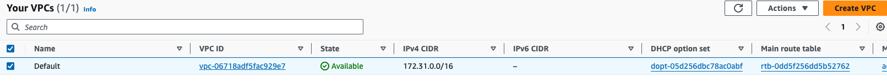

<b>Creating an Amazon Virtual Private Cloud (VPC) with AWS CloudFormation</b>

Using AWS CloudFormation is an excellent way to deploy VPCs in a reliable, repeatable manner because the template used by CloudFormation acts as documentation to show exactly what is being deployed.

Create Stack:

Verify the stack under Resources Tab:

<b>Verify VPC</b>

  <i>VPC:
    Type: AWS::EC2::VPC
    Properties:
      CidrBlock: 10.0.0.0/16
      EnableDnsHostnames: true
      Tags:
      - Key: Name
        Value: Lab VPC </i>

<b>Internet gateway:</b>

<i>InternetGateway:
    Type: AWS::EC2::InternetGateway
    Properties:
      Tags:
      - Key: Name
        Value: Lab Internet Gateway </i>

<b>Subnets:</b>

Public Subnet 1 is connected to the Internet via the Internet Gateway and can be used by resources that need to be publicly accessible.
Private Subnet 1 is not connected to the Internet. Any resources in this subnet cannot be reached from the Internet, thereby providing additional security around these resources.

<i>PublicSubnet1:
    Type: AWS::EC2::Subnet
    Properties:
      VpcId: !Ref VPC
      CidrBlock: 10.0.0.0/24
      AvailabilityZone: !Select
        - '0'
        - !GetAZs ''
      Tags:
        - Key: Name
          Value: Public Subnet 1

  PrivateSubnet1:
    Type: AWS::EC2::Subnet
    Properties:
      VpcId: !Ref VPC
      CidrBlock: 10.0.1.0/24
      AvailabilityZone: !Select
        - '0'
        - !GetAZs ''
      Tags:
        - Key: Name
          Value: Private Subnet 1 </i>

The code is retrieving a list of Availability Zones within the region and is referencing the first element from the list. In this manner, the template can be used in any region because it retrieves the list of Availability Zones at runtime rather than having the Availability Zones hard-coded in the template

<b>Updating a Stack </b>

Updating stack with one more public subnet and private subnet. 

<b>Delete the Stack</b>

